# Extracted Learnings

These learnings have been pulled out from various notes acquired from various trainings, articles, books, etc. These learnings can be considered as a quick reference notes in case of a brush up on a particular topic.

## Table of Contents

- [Extracted Learnings](#extracted-learnings)
  - [Table of Contents](#table-of-contents)
  - [VS Code](#vs-code)
  - [Angular](#angular)
  - [User Experience](#user-experience)
  - [Unit Testing](#unit-testing)
  - [Typescript](#typescript)
  - [Security](#security)
  - [Node JS](#node-js)
  - [Markdown](#markdown)

## VS Code

- Fast, cross platform, intellisense and auto complete, debugging, rich refactoring, sits perfectly between editor and IDE.

- What is Editor - lightweight/fast, file/folders, many languages, many workflows, keyboard centered

- What is IDE - project systems, code understanding, debug, integrated build, file->new, wizards, designers, ALM integration, platform tools

- Electron is a native shell for widows, mac, and Linux that hosts JavaScript-based app like Monaco. Visual studio code is a combination of Monaco and Electron.

- Installing extension locally – copy your extension to the VS code extension directory. (windows - %USERPROFILE%\.vscode\extensions)

## Angular

- Angular is a tool to help you build interactive websites, you can call it a framework. It provides tools to communicate with the server and to improve the performance, package application, maintain state, organize code/logic, ease display of data, synchronize state as it changes.

- Angular 2 is more standard based (modern web standards), modern (state management, change detection, etc.), more performant.

- Angular releases major version every 6 months, 6 months of active support and 12 months of LTS support (only security and bug fixes, no new features unlike active support).

- Universal benefits – reduction of cost, standards compliance, extremely performance, open source, use typescript, backed by Google, very uniformity (make onboarding new developers cheaper and simpler), amazing documentation.

- It indirectly provides environment for router, HTTP, forms, RxJS, etc. Already configured with Typescript no need extra to configure, opinionated means fewer decisions to take. Provides support for progressive web apps, lazy-loading, fully reactive forms library support, fully featured router, animations library, supports strictly typed forms.

- Angular also supports server-side rendering, mobile friendly, angular language service (Intellisense and better debugging in templates).

- Components – building blocks of modularity. It breaks up display of application in manageable chunks. It has display and logic.

- Services are a place to put logic which is not related with the display like checking more than article reading limit has been crossed or not.

- Directives are a way to give existing tag a new functionality like making elements or appear on hove, control the visibility, etc.

- Pipes is used, to format the data to display like uppercase.

- Modules are not optional in angular 14. It is a grouping of other features like services, components, pipe and directives, it can also include other modules.

- Application state gets changes on user interaction, http service response or by timer execution.

- Efficient change detection – first the state gets change then cascading changes occurs and finally re-render of page.

- Inefficient change detection – the system is not smart enough to identify the cascading changes and re-render the UI multiple times.

- Zone.js is a wrapper on the things which can change the state change like user interactions, http and timers, it knows when these things gets completed. Angular then subscribed to notification from zone.js so that it can run the change detection and re-render the display.

  

- Rendering targets provided by angular – browser/DOM, server-side, native mobile apps, native desktop apps.

- Angular CLI solves JS fatigue problem which setting up the JS environment to build an application.

- Server side rendering – increase performance as initial download size gets reduced, increase render time, search engine optimization. Modes – full pre-render, dynamic pre-render, client-side switch.

- To build the native mobile apps with angular, there are two common tools ionic and NativeScript. For Native desktop, we need to use Electron.

- Angular testing utilities – TestBed – helpful in testing component with templates. It helps to constructs component in small, live, angular environment and gives us handles to wrapper around component and DOM created by its model. Async and fakeAsync, MockBackend.

- AOT – browser needs to compile the templates into DOM Functions i.e. the actual views. The AOT does it during the compile time itself.

## User Experience

- Software has to work and be easy and enjoyable to work. User can easily and quickly accomplish their tasks.

- Wireframe types - Low-fidelity, High-fidelity.

- Principles - Alignment, Contrast, Visual hierarchy, Proximity, Layouts, Whitespace, Consistency.

- UX Testability

  - Visibility of System Status - the system should always keep users informed about what is going on, through appropriate feedback within reasonable time. Like showing username on login, showing copy/delete progress windows OS.
  - Match between system and the real world - the system should speak the user's language, with words, phrases and concepts familiar to user. Like not using words like `Accept/Decline` but `Save password/Nope`.
  - Error prevention - like showing auto-complete, showing confirm dialog before deleting the record.
  - Recognition rather than recall - showing dropdown, intellisense

- The good user experience has 3 desired results – happy, satisfied and productive. Our ultimate results should be delighted, contented, and empowered.

- Avoid common pitfalls - throwing data on the screen, exposing tech to the user, forcing the user to think like DBA, Messy UI, coding for expert user.

- 10 UX myths - low friction clicks are okay, vertical scrolling is okay.

- Leading hack - making the user brain work less by leading them to their goal. Showing steps (wizard) on the screen.

- Limit the number of colors used should be 5 or less.

- Reading in upper case takes 10% more time than lower case, so avoid using them.

- A UX developer can bring efficiency, logic, relevance, user advocacy, research, communication, effectiveness, interaction, elegance, simplicity.

- Types of industry - Finance, Education, Retail, Healthcare, Business & IT Services, Research & Development, Government and Defense.

- In natural world there is no monochrome except blue sky overhead on a clear day, even sky is a gradient. So, while creating UI component use gradient from light to dark as top down lighting bias to makes the screen appear as more natural not as artificial monochrome. And the gradient shouldn’t be noticeable and flashy

- Instead of rectangle design, we should use curves. Humans usually prefer curved things over sharp-edged things – curved connotes safety, sharp-edged connotes danger. Curve soften the design and less stressful.

- We should bring the UI element on screen on more gradual way and move that from one place to another in gradual way too or changing the size. Using animation as it feels more natural and don’t surprise or confuse user. While changing the screen from one to another also try to implement a subtle animation. Animation also help in maintaining context.

- When an action is not appropriate, prevent the user from doing it, provide a visual signal that the action is not available, like disabling a button instead of allowing it to click and showing error message or any popup.

- Sliders component are good for numbers with large increments of numbers where the user is not quite so interested in precision.

- Reserve confirmation for very exceptional circumstances, otherwise it will dilute its value like in windows vista. Instead of this we can provide some undo like functionality or show a countdown before making the commit to the database, this is called forgiveness

- Web fonts recommendations

  - 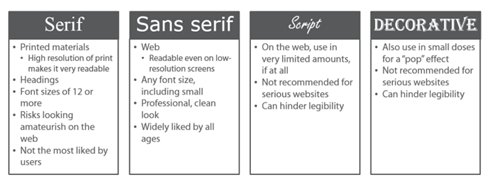
  - 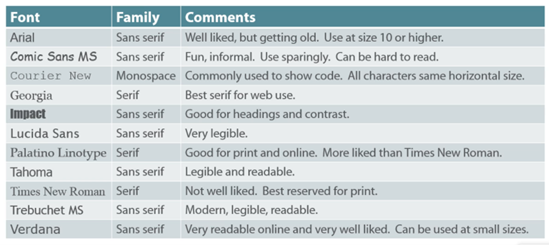

- Color meanings

  - 
  - 
  - 
  - 
  - 
  - 
  - 
  - 

- Color preferences
  - 
  - 
  - 
  - 
  - 

## Unit Testing

- In constructor method we should only build objects and prepares them for use. Don’t construct other dependencies, talk to external resources, execute initialization logic or application logic. Don’t write any logic in constructor. Just use assignments. We should inject dependencies assign to the private variables inside constructor.

- Actually, legacy code is the one which doesn’t have automated test for it. It makes the code more brittle and harder to maintain and extend.

- 

- Types of testing - unit testing, integration testing, acceptance testing (user interface).

- Immutability – an object can’t change its state. Anytime a method would change the state of the object like pushing an item on a stack, it needs to return a new copy of the object with the change. The previous instant remains unchanged. It helps us in writing concurrent code more easily

- Test doubles - it is a generic term for any kind of pretend object used in place of a real object for testing purpose. Types - stubs, fakes, mocks, spies.

- Stubs provide canned answers to calls made during the test. when a fake is being used as a means to guarantee a certain date is returned. A fake is stub when it needs to be setup before the action so that the action can be controlled better, but the results from the action remain the thing being tested, not the fake itself, for what the mock is used for. When a fake is the thing being tested then it is mock as a assertion.

- Mocks are pre-programmed with expectations which forms a specification to be verified.

- Fakes – to isolate our unit test from external resources like API calls. MOQ is a faking library that will help us avoid some of the boilerplate of faking our tests.

- Unit tests are less brittle that’s why they are preferred a lot. It tests smallest behaviour.

- What is pragmatism? A reasonable and logical way of doing thing. that is based on dealing with specific situations instead of ideas and theories.

- Testing structure types - AAA (Act, Arrange, assert), Behavioral (Given, When, Then)

- Anti-patterns – we should test the overall behavior details instead of implementation details. So, don’t overuse of mock, prefer stub. Focus of return of the function instead of inner details. Tests should be short and to the point.

- Static method should be used only for pure functions like those methods which returns same value for same input, and in future there would be not change needed for those method implementations like math library inbuilt function.

- When adding code to a fixture setup or teardown is that only code that is 100 percent common to all methods should go over there. If a lot not all methods have some common code then use helper method.

- In unit testing don’t use random number to generate random number to test some value, it can generate random failures. So, we should not have random logic.

- We can also have the stub return a certain value if the test subject is expecting a return value. For cases where we are testing interaction behavior we will create a mock that knows it was called, with what parameters and how many times.

- Naming convention of the test method – choose any naming convention for unit tests that works for you and only try to stick with it consistently throughout the project.
- Instead of using the manual mock we should use automatic mock like MOQ library.

- We should avoid loops and branching instruction in tests, they may lead to bugs in testing code. It also reduces the cyclomatic complexity.

- Precondition and post-conditions of a method pattern, like passing an empty array to an method. In this case the caller function should check the param input before calling to the function, in preconditions a Boolean condition which must be satisfied before a method is invoked, in post-condition a Boolean condition which must be satisfied after a method completes

  - Method pre-condition - condition which must be satisfied before method is invoked.
  - Method post-condition - condition which must be satisfied by the invoked method after it executes.

- Try to avoid giving classes same names as interfaces they implement, what is specific to this class. Interface names are operating at abstract levels, class names are operating at implementation levels. Interface names are normally vague, inconclusive, while class names are sharp and to the point.
- If a method does not want to accept null parameter then it should not throw an exception as it would be meaningless to the caller function.

- We should handle exceptions like below -
  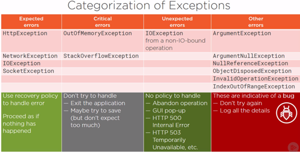

- Styles of unit testing – output verification or functional verification, state verification, collaboration verification.

- Writing the test is easier then running the application. Testing is not like frosting on the cake, but it is sugar or flour which needs to bake when we are preparing the cake not in the end. This is also same issue with automation testing.

- We should break into code into two type of classes, one which have business logic and others which make stuffs. Don’t combine both classes.

- Benefits of unit testing – higher quality, fewer defects, living documentation, well-crafted code, automatic regression harness. A unit test confirms functionality of a small unit of functionality or component in a larger system.

- Code refactoring should not change the functionality of the application, in the same way the unit test case should not be fail. Refactoring is like cleaning the kitchen after serving food to customer. It improves readability, maintainability and scalability of code. We should refactor the code after fixing a failing test, before adding a new feature or after identifying a quality problem. Simple refactoring – rename, introduce parameter, extract method.

- Isolating code -

  - Dummy – it is the simplest and most primitive type of test double and will contain no implementation.

    ```typescript
    var person = new Person();
    person.first = 'John';
    person.last = 'Snow';
    Assert.IsNotNull(person.fullName);
    ```

  - Stubs – it is a minimal implementation of a class that likely implements a given interface or some abstract base class. It doesn’t maintain state and leaves method unimplemented like it just return some hard-code value directly:

    ```typescript
    public class StubRepo: IOwnerRepository
    {
    public IOwner FindById(int id){}
    public IOwner save(IOwner owner)
    {
    return new Owner();
    }
    public void Delete(IOwner owner){}
    }
    ```

    - Fake – building on a stub and adding a bit more sophistication is the idea of fake. It contains a bit more complex implementation by having state but not functional implementation. Like below we actually add and delete the list.
      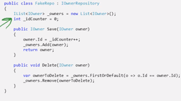

    - Spy – it records the information about the interaction that it has with the SUT. This information can be available for assertion purpose by the test itself.

      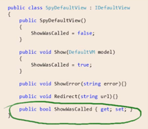

    - Mock – can be used to simulate complex behavior. We should not develop mock our self, we should use mock libraries which allows us to configure mock behavior. Libraries example – type mock, rhino mock and MOQ.

- We can have separate build environment for acceptance test running and can trigger once a day. We can also share it reports to business for progress:
  

- Prudent code coverage – 100% code coverage doesn’t mean no defects. Use code coverage as a developer tool not a performance metric. Let the code coverage find things that are important enough to add test, but realize that it is only contextually important and it is very rare that we need to strive for any sort of code coverage numbers up around 90 and 100%.

- Devi’s advocate, Gollum style and Ping Pong technique to write unit test case:
  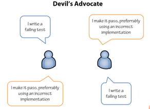
  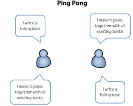

- While creating an interface it should either contains all properties or all functions not both.

- It is not creation of millions of objects that keep application from being efficient but it is rather the efficiency of methods that we are executing that may make it slow. So, we can create many objects using immutable objects without causing any performance issue.

- We should only throw exception if there is no way for the application to continue working under circumstances, otherwise implement different use case as-well. Also, don’t handle the exception in immediate caller but at the top most caller, the one which initiated the whole operation, by this the lower parts of the code will be clean from complicated error handling code, they will focus on normal control flow. We can handle this by showing a pop-up to user, retry the function or simply ignoring the error and moving forward. While using the immutable objects try to keep them small.

- While designing a class it should contains operations which naturally belongs to the class, if operation doesn’t belong to a class the move it out to a dependency and use the dependency to complete the operation.

- Test doubles – dummies like a placeholder, stubs objects that return predefined data, fakes slightly more realistic, mocks objects pre-programmed with expected outputs for given inputs and also able to verify their calls, spies real object and verify interactions like mocks it is an hybrid of stubs, fakes and mocks.

- Marble testing is a technique where we draw marble diagrams using ACSII characters while writing unit test to visualize asynchronous observables behavior in a synchronous way. Benefits of marble testing – readable code, test synchronously and helps to find out race condition in our code. Marble syntax - -, |, #, ^, !, a, ()

- For empty observable use |, for never use \_ or ----.

- Hot observables start emitting the values before any subscribe method is called on. Any subscribers can subscribe at any time and they can get the latest values at the time of subscription. They are multicast means more than one subscriber can subscribe to this observable however they will listen to the same producer. Publish and share are used to make a hot observable like tune radio channel, cinema theater, mouse clicks, live movies, live cricket match, stock tickers, live life events.


- Cold Observable – In RxJs the observables are cold by nature. Cold is when the producer is owned by the observable. Observable creates and activates the producer at the time of subscription only. The data is created from the observable itself. Will produce data only when subscribe method has been called. Subscriber get their own copy of values and they are unicast i.e. one subscriber per producer like of, from, interval, timers. Real life example – watching downloaded movies, recorded podcast or song, snapshot movies in which each have their own copy.

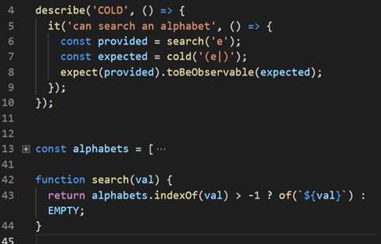
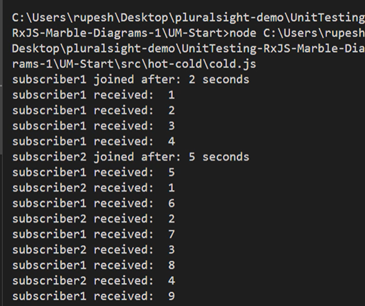

- Frame – Jasmine-marbles convers observable sequence into frames. Frame is a JSON that consists of RxJs notification object that wraps the actual delivered value with additional metadata and message type.

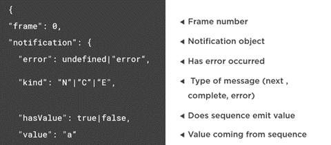

- RxJS schedulers are centre to control the time for any operator or observables in our project. Also, RxJS has made this schedulers injectable so that we can mock these schedulers and control the time in our test cases.

- Scheduler is a primitive inside RxJS, RxJS operators take scheduler as the second optional parameter. It is async by default. Marble testing uses virtual time so that we can test these async function synchronously.

- Race condition scenario – in a scenario where we are searching a string, and first search return the value with a delay than second one, then in the result we will get the first result as a final response by overriding the second one. To avoid this we can use the switchMap operator, it will cancel the previous Http request in-case of second has been triggered and always return the latest result.

- In integration test we test component and its template together. In integration if we only test parent component then it becomes shallow integration test otherwise if we also test its working with its child or directive component then it becomes deep integration test.

- To write the integration test to test the template along with component, we need to use the ‘Testbed’.

- A component fixture is a wrapper for component that also has few extra properties for testing, we can use its one of the properties called componentInstance to get the instance of the component itself.

- Use fixture.detectChanges() on component spec files to tell the component to run change detection and update any binding that may exist on the component. It will also cause to ngOnInit() lifecycle to run.

- The flush() method lets us decide what data to send back when the call is made.

## Typescript

## Security

- Content Security Policies (CSP) Reporting - It is regarding the policies send alongside with website says where can this page load images, scripts and styles from, and where the form can post the requests and the browser will restrict the page accordingly. We can send it either in http header or metatags. We can also mention the report-uri where those reports will be sent. It was originally design to stop cross side scripting.

```typescript
Content-Security-Policy: upgrade-insecure-requests
Content-Security-Policy-Report-Only: default-src https:;report-uri https://demo.report-uri.com/r/default/csp/reportOnly
```

- Certificate Authority Authorization (CAA) Reporting - CAA is much safer than HPKP, by which we can say whom we want to authorize some particular CAs to be able to issue certificates for us.

- Cross-site Scripting (XSS) Reporting - Now, the browser has built-in an XSS auditor, in XSS attack we generally have kind of get parameter they sent to the server, rendered into the DOM and then reflected back to the browser.

```typescript
x-xss-protection: 1; report=https://report.uri.com/xss/enforce
```

- Broken Authentication – passwords are very vulnerable and very in-secure. We can refer haveibeenpwned.com and avoid user to choose the password which were breached in history. The password rotation was never a good policy and it works against us as humans are terrible at passwords.

- Sensitive data exposure – SSN, credit cards information, addresses, religion, health records, political affiliation, birthday. Combination of these information can become dangerous.

- XML external entities (XXE) – SAST static source code analysis (manual code reviews), we can also use DAST tool for testing.

- Broken access control – IDOR, indirect object references, where we can twiddle a value in the URL to get someone else’s data. We should test access control so that we can’t do things outside of our privilege level.

- Security Misconfiguration – weak ciphers, SSL problems, we can use tools to check them.

- Cross-site scripting (XSS) – latest frameworks are helping to prevent this vulnerability.

- Insecure deserialization – remote command execution (RCA) running command on other server, and another thing is changing the serialized objects to elevate our privileges to do something interested, tempering of objects. To avoid this, we can use HMAC and check the validity of object type on server to check its integrity.

- Using components with knows vulnerabilities – we should break our build if any vulnerable component is found. Latest package manager automatically detects such problem with 3rd party libraries and CICD we should break the build. We can use CSP to avoid such issues.

- Insufficient logging and monitoring – we should have some sort of audit trails in place.

- HSTS helps us ensure that connections are always made securely and they never drop back to HTTP.

- What Is Serialization and Deserialization? - When we want to store an object to disk then we need to represent the multi-dimensional object into a flattened format. So, serialization is converting an object into a byte stream. A byte stream can be a file or a data stream over a network.

- Insecure deserialization – (serialized) data abusing the security of an application when being deserialized. Abuse of logic, corrupt data, denial of service, remote code execution. It is possible to execute arbitrary code merely by deserializing a corrupted or untrusted file. It affects confidentiality, integrity and availability.

- We should not use equal sign to compare the two strings as it is not cryptographically secure, as it will lead to timing attach, so always use built-in functions to compare hashes with each other.

- The dangers of logging too much – legislation, confidentiality (credentials, payment details, sensitive information), information overload, cost of processing information. Information exposure through and error message – the dangers of showing users, or non-privileged accounts error messages.

- Certificate authorities – it is an entity that issues digital certificates. Our machine needs to trust a CA. The CA signs the certificate; and when it is returned to the browser from the website, our machine validates that the certificate is legitimate by referring to our local list of trusted authorities. To check this list use certmgr.msc from run command, this list is used by windows, ie and chrome.

- SSL vs. TLS – we should ideally use term TSL not SSL as SSL is dead already:

- HTTP strict transport security (HSTS) – now redirect will give 307 status instead of 301, also the size would be 0. The browser will perform 307 internal redirect. Once our browser sees the STS response header, for the period of time, specified in that max age value, it will not make an insecure request to that domain.

```typescript
strict-transport-security: max-age=2592000
```

```typescript
Status Code: 307 Internal Redirect
Non-Authoritative-Reason: HSTS
```

- Secure cookies – capturing someone cookie will lead to session hijacking. Secure cookie will not get send over insecure connection. So, always use secure cookies flag as default setting:


- Using HTTPS will reduce the load on client and server both sides. As HTTP uses 1.1 protocol but HTTPS uses h2 protocol i.e. HTTP2, and HTTP2 allows for a binary stream of content, so lots of data coming down to the parallel. HTTP2 is only supported over TLS.

- Getting new certificate and renewing it has very less cost involved. We can use letsencrypt.org for free certificate authority. We can use cerbot.eff.org for automatically renewal of the certificates.

- To avoid enumeration risk, show below message when login failed, like a generic message, don’t say that user doesn’t exist:

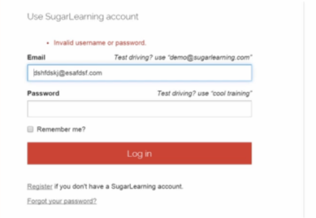

- Even in below case, if user type unavailable password then don’t show that it doesn’t exist, as we don’t want to show presence of a user on our system:

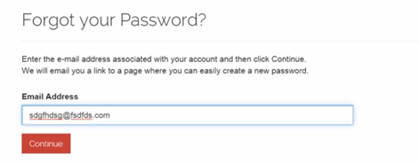

- To solve an issue where account is already exist, sent an email to their registered email, so do not show message like "Username already taken".

- Brute force attack is to guess someone else password again and again, hackers use botnet for this which provides thousands of different IP addresses, so we cannot verify the request per address. If someone try to do failed login with many attempts, we can simply lock his account or can have a buffer for some minutes to let them retry. Or use OAuth with google or Facebook to delegate this problem to them.

- In password strength do not put maximum limit threshold, as user want to use pass phrase.

- With anti-automation aka Captcha is bad for user experience, it is used to avoid bot to create spam registrations. Using Captcha on registration/signup is okay as it will be one-time activity for a user, but we should not use it on login.

- Multiple simultaneous logins – it depends upon business needs, like for bank website we should not allow it, but for website like stackoverflow.com we might allow it as user wants to open that website from multiple of devices. It is also not feasible on server to know whether a user is logged-in or not, as the cookie is based on client interaction.

- Broken authentication and session management – to protect the cookie from session hijacking, we can secure it by setting it as HTTP only by this cookie cannot be read by client script to avoid XHR attach to read that cookie, if we also set the secure flag to true then it can only be sent over HTTPS connection.

- X-Frame-Options – if we use deny value then it means this page cannot be framed, means cannot be put inside iframe of any other page. This helps in prevent click checking.

```typescript
X-Frame-Options: Deny
```

- Security threats on server side - SQL injection, insufficient authorization, weak credential storage

- Security threats on client side - Cross site scripting, insufficient transport layer security, click jacking.

- Non-standard and browser prefixed headers – headers started with X was browser specific and has been deprecated now – X-Content-Security-Policy, X-WebKit-CSP, X-Frame-Options, X-XSS-Protection.

- Using HSTS (HTTP Strict Transport Security) – it will tell the browser you may not make an insecure request. Internally within the browser, you need to redirect or effectively go and make that request securely. That’s it also took only fraction of millisecond for first request with 307 status code, so by this the man in the middle won’t see this first request but the second request only.

```typescript
Strict-Transport-Security: max-age=31536000; includeSubdomains; preload
```

- HTTP Public Key Pinning (HPKP) - This is progression over HSTS, which tells the website must also serve a particular certificate that the browser expects, not just on that’s valid but one that adheres to a very specific set of criteria, to avoid a scenario where certificate authority itself gets compromised.

```typescript
Public-Key-Pins: pin-sha256=[pin 1]; pin-sha256=[pin 2]; max-age=2592000; report-uri=[uri];includeSubdomains
```

- The frame-ancestors – to avoid click jacking attacks. Attacker would embed the targeting website in his website into an iframe, then making that target website transparent putting content the attacker provides under the target website and enticing the user to click what they think is a button the attacker’s website but instead clicking a button on the target website. We can avoid this by this header so that our websites won’t be framed into some other website.

```typescript
frame-ancesors: 'none';
```

- Brute force attacks – an attacker trying over and over again to execute some sort of online process like trying to login into someone account with different password.

- Cross site request forgery – changing the password or account details using context of hacker. Use anti-forgery token to avoid this.

- Encryption is also not secure, because as soon as the encrypted key is found, entire system can be decrypted back. Instead of this we should use cryptography using hash so that no one can decrypt them back.

- We need to use hashing with a salt to avoid getting same output with same input, it also protects with rainbow table problems, but we need to use hash algorithm properly:


- Email as username vs. free text for username for uniqueness – we should prefer email as username. Email as username is easier to remember, one less field to capture at sign-up, it is already unique per user, must be able to change in future. Free text for username can be displayed to user with less privacy risk, enable multiple accounts against one email, requires a "retrieve my username feature".

- Password strength criteria – don’t limit the max entry criteria, also don’t put any condition for not having special characters, don’t discriminate with some character, allow user to pass any character. Pass phrases are stronger. We can use utility like 1password to generate password and saving it into centralize place.

- We can also make backend call to check whether password is very simple to crack, then show as invalid like below, we can check it with bad list of passwords.

- Don’t disable the password paste option on the field. People disable it to avoid brute force attack, but disabling the paste option, make the other worst problems like bad UX. To solve a problem, if that solution makes the problem worse than it is called as cobra effect.

- Verifying accounts via Email to avoid entering fake and corrupted emails, as user can use any random or someone else email’s id.

- Using CAPTCHA for anti-automation – suppose someone made a automation tool and in make thousands to call for sign-up then that email person will get those many emails which will lead to spamming. To avoid this, we use re-captcha.

- Protecting the logon against brute force – degrade the service means for each time failed logon take some more time for re-login and sending the response back by using thread sleep, and we can return a message that maximum retry has been exceeded, please try after sometime. So, each request will take longer time, server can track number of hits against the account.

- Don’t lock an account out as it will lead to DoS (denial of service) attack. We should degrade the service and log everything. Don't lock an account out, restrict logon by IP and limit attempts with a cookie.

- We should generally allow simultaneous logons by a user from different machine, unless business requirement like banking website, but to not allowing multiple simultaneous logons will have many edge cases which we need to support as-well like unsaved data.

- Remember Me - This feature frequently implemented insecurely, by using user name and password in cookie and using it for re-login. It is a feature which requires trade-offs: security versus usability. It can disclose the credential of a user. It reduces the fiction of return visits for frequently used services like stackoverflow.com. It allows long-running sessions. But it increases numerous risks – someone else using the PC, a CSRF risk being exploited, if someone has access to unlocked machine. To make available this feature, it depends upon the nature of the application. We can give this option just for remembering the Client ID not password for sensitive websites, but this is not a remember me feature completely as it won’t do the auto login when user comes back to the website

- If we have expiry as ‘session’, then if we close the browser and reopen it, we won’t be able to logged on, the cookie will go away. If we use remember me feature, then it will have one more cookie for expiry of 1 year, it will not go away and reauthenticate the user again automatically. To implement it securely, don’t create remember me cookie, just change the auth token cookie from session scope to sometime duration scope like for a week, also mark http and secure flag as true. Additional security controls – like ebay we can choose an approach where we are breaking the cookie into two parts, first for user identity for long expiration time, and another cookie which requires for financial activity for short duration and re-authenticate user for the financial activity only.

- How attackers change account details – direct browser access, credential theft, CSRF, session hijacking (sending session on HTTP connection on in query strings), social engineering.

- Account attributes attackers want to change – password, email, identity, credit card, attackers can chain together these many information and processes in order to gain access to a victim’s account.

- To change the password or email, we should also ask the current password as-well, also keep change password feature on its own page

- Account change notification – to cater a scenario where attacker already got the access for legitimate password, we need to notify the changes on different channel as-well like email or SMS. We should not allow to change the email address without first confirming via the original email address on the account. But if user not have access to original email then it will be a problem, then we can solve this by directing to manual human interaction at support desk.

- The risk of password hints – don’t use password hint in any circumstances.

- Why logging off is important – due to remember me we can have a long running session – also in browser if we choose below feature, then browser won’t delete the cookie after browser gets closed browser even if we don’t use remember me feature, so to avoid this we need to provide explicitly logoff functionality.

- What constitutes of logging off – it removes the authentication token, by setting remember me token as empty and setting cookie expiry one day ago already.

- Web application firewalls (WAF) – we can get it by using Cloudflare service, it will look request pattern and reject it if it found malicious before allowing it to hit the actual web server:

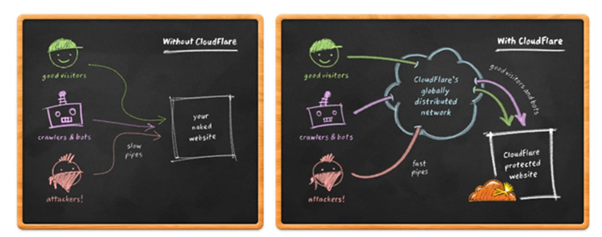

- We should keep common barrier of defines around and apply same business rules like for brute force check, whether it is getting called by API, mobile, desktop or some admin. To have code reuse pattern will help here to avoid inconsistency of codding logic for different channels.

- We humans are the weakest link in the security chain.

- In symmetric cryptography same key is used to decrypt and encrypt the message, but asymmetric cryptography uses different keys to avoid man in the middle attack

- Types of cryptograph algorithms – symmetric, asymmetric and hash functions.

- Asymmetric algorithms – public and private keys, the RSA algorithm.

- Big O notation allows us to express in terms of the size of the input, the amount of work takes to solve the problem -

- 

- Public key can identify somebody, and their private key can prove their identity.

- OpenID Connect – it allows users to log in to 3rd party sites using their Facebook or twitter or google credentials. It is built on top of OAuth.

- Evolution of software ecosystem -

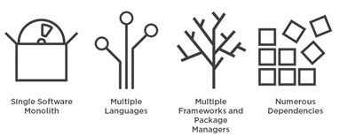

- Types of versioning – calendar based, sequence based and semantic based versioning. Recommended is semantic based versioning.

- Common sources of untrusted data – in the URL via a query string or route, posted via a form, in cookies, in the request headers, external services, our own database.

- We should sanitize the data right after receiving from the user. So, if user trying to search like "<i>enzo</i>"`then the text should display on the screen in encoding form of it i.e.`&lt;i&gt;enzo&lt;/i&gt;

- Cookies - It is simply a text of data stored in browser. Cookie attributes – domain, path, expiration, HttpOnly, secure. To reduce risk further we can set expiration time on cookies. For some we can set for current session only and for some for a shorter or longer time even if user close his browser.

- We should trim down all the header from HTTP response which might disclose the framework or the server underline technologies details. We can also change the header properties sort order and default bad request or default response format which was specific to some server format to avoid attacker guessing the server details.

- HTTP fingerprinting of servers – it is to identifying various attributes of a particular website which might lead it to disclose what is running underneath.

- Fuzz testing – it is the process for searching for vulnerabilities does commonly adhere to a very regular pattern like in XSS to avoid laborious manual testing, and we bombarding an application with random data with those patterns. We can use third party tool like intruder21 or fuzzdb for doing fuzz testing.

- Mounting a click jacking attack – in this the attacker will also get the access of anti-forgery token by rendering the website into iframe and setting as opacity to 0, and below to that page will render the corrupted website. In below the I “Wanna win!” button is overlay on “Change Password” button

- We should store password using hashed approach while saving the database. If we store it into plain text then there is cryptography, everything is immediately exposed if the password storage is breached. If we use encrypted approach, then it can also get decrypted which makes is less secure. Only if we use hashed approach, it would become one-way, deterministic algorithm which means that password can't be un-hashed.

- We should re-authenticate the user before key actions, like asking current password on change password screen.

- Unlike browser, mobile app doesn’t have secure paddle lock icon, as mobile app doesn’t run in browser. The mobile app, company itself handle the client communication, so we should not always trust the mobile apps.

- We can have two types of certificates DV and AV. Below is an AV certificate, it requires a business name also need to be registered.

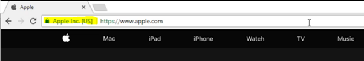

- We can connect fiddler for the remote machine-like android device from our computer. By this we can intercept mobile app data in fiddler. By we can get a sense for how device is communicating with backend servers.

- Instead of using the .png format we should use .jpeg format as it has better compression and can reduce the data size 75%.

- By using Wi-Fi Pineapple and LAN Tap, we can monitor the traffic even for those devices which makes hard to proxy traffic like IOT devices.

- Discovering leaky API’s – we should not return sensitive data from the web API in normal text form, also don’t return the data which is not need or non-essentials data on client side

- The role of OpenID Connect and OAuth – OpenID Connect is a simple identity layer on top of the OAuth protocol. It allows clients to verify the identity of the end-user based on the authentication performed by an Authorization Server, as well as to obtain basic profile information about the end-user in an interoperable and REST-like manner. OpenID is for authentication and OAuth is for Authorization

- Configuring fiddler to decrypt encrypted connections – it will install its root certificate on our windows machine, by this we just compromised our system (PC) only.

- LDAP kept our user directory together, assign roles and query information about the user.

- OAuth2 is about requesting access tokens from an authorization serve, then we can use this token to talk with backend service. OAuth is an open protocol to allow secure authorization in a simple and standard method from web, mobile and desktop applications. OAuth is about delegating authorization; means we want to authorize a client to access our resources on our behalf.

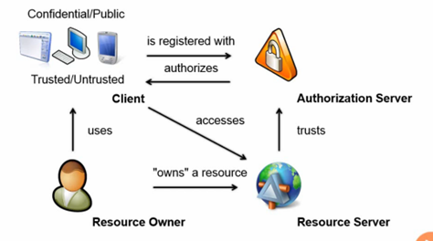

- The idea of OAuth2 is how we can create valet parking key, not the master key. By which a resource owner gives the client a key to access the resources on the resource’s behalf, without giving the client master key aka the password.

- OpenID connect means the application doesn’t need to connect with back-end service, but it needs to know who the user is. It is for authentication.

- Security tokens are protected data structures, contain information about issuer and subject, signed and typically contain an expiration time. A client requests a token, an issuer issues a token and a resource like API consumes a token, that resource has a trust relationship with the issuer.

- History of token - SAML (XML based, very expression, many encryption & signature options), Simple Web Token (SWT), JSON web tokens (JWT).

- JWT structure and format - headers (metadata, algorithms & keys used), claims (issuer, audience, issue at, expiration, subject, other application defined claims)

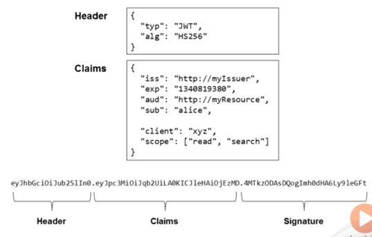

- There are two type of tokens access tokens (short lived) and refresh token (long lived).

- OpenID Connect - It is built on top of OAuth2, and sometime we just need authentication at least to begin with to identify user in an application. OAuth2 is regularly abused for that.

- OpenID connects adds some new concepts like ID token and UserInfo endpoint. OpenID code flow – identity provider, authorization endpoint, token endpoint, user info endpoint.

- OAuth2 Concerns - Specification bloat, bearer tokens, security theatre, attack surface.

## Node JS

- What is REST - REST means representational state transfer (ReST). If we are storing information about the request or about the client, then we are not writing a truly a restful service. We also need to tell the client of caching, means caching timeout so that next time client doesn’t to call server to fetch data. One more constraint is the uniform interface, we need to deal with resources those are nouns not actions so don’t name authorize or login but like books and authors. HTTP verbs defines actions, also use PUT for update the object.

- Mongoose is an ORM for MongoDB. We don’t have to deal with MongoDB directly, mongoose is going to do that for us.

- Updating data - PUT verb replaces and item but PATCH only changes a piece.

- Middleware – It is going to inject itself in between the calls and this route.


- Implementing PATCH – Need to use the Object.entries() method to out an array of key-value pairs from req.body and run for-each on it to modify only those properties on object which got change, so need to check every property manually

```typescript
const { book } = req;
if(req.body._id) {
delete req.body._id;
}

Object.entries(req.body).forEach((item) => {
const key = item[0];
const value = item[1];
book[key] = value;
});

req.book.save((err) => {
if(err) {
return res.send(err);
} 
 return res.json(book);
});
```

- HATEOAS - Using hypermedia to building self-documenting API, it is very easy for someone to navigate and understand what options are available to them anytime while they are using our API. HATEOAS means that list of links available to us that help us navigate the API.

- Node.js provides a wrapper around V8 JS Runtime engine to provide additional functionalities for building network applications. It is fast because all written in C language. We can build WebSocket server, fast file uploading client, Ad Server, Any real-time data apps. Node.js is not a multi-threaded application. Benefits of non-blocking code – files will be read in parallel


- We use javascript with Node.js because javascript makes easy to do evented programming using the event loop and makes the code non-blocking.

- Node register the event whenever request comes in, whenever it is done registering the script, it starts the event loop when finished means it checking for events continuously, whenever a request comes it trigger its call-back. Known events are request, connection, close, timeout these evets further more events, one event at a time will get processed in event queue, other will be queued in event queue.


- Node JS server can simultaneously handle uploading of two files, one of main reason of Node JS creation is to handle the file upload. Other web apps try to load entire file into memory before writing it to the disk which can cause all sorts of issue at server side, also tricky to provide the progress of file uploads, but in Node JS we can do it very simply.

- Express is Sinatra inspired web development for Node.js, i.e. insanely fast, flexible, and simple.

- Node is generally deployed on Linux machines in production.
- Execution of javascript on the server is not done by Node, but it is done with a virtual machine, VM like V8 or Chakra. Node is just the coordinator, it is the one who instructs a VM like V8 to execute our javascript. So Node.js is a wrapper around a VM like V8. V8 will tell the results to Node and Node will tell this result to us. Node comes with built-in modules providing rich features through easy-to-use asynchronous API’s. this works great because V8 itself is single threaded, this is also true for browser.

- Node offers async API’s that we can use and not worry about threads, to do things in parallel without needing to deal with threads this is the biggest benefits of using a runtime like node. We can also create addons using C++.

- NPM is basically the world’s largest of free and reusable code.

- Node has a reliable module dependency manager usually referred to as CommonJS. This is basically the “require” function in Node combined with the “module” object.

- Node.js is like the kitchen itself, it allows you to execute lines in our recipes by using built-in modules like our oven and sink.

- REPL stands for Read, Eval, Print and Loop. Use the ctrl + l to break the REPL session.

- Using Async/Await – it is easier to read.

- Due to the package.lock.json file, other team members will also get the exact same versions event for the sub-dependencies tree. This contains the project’s direct dependencies but also whole dependencies tree for the project.

- The event Loop – what node uses to process asynchronous actions and interface them for you so that you don’t have to deal with threads.

- We should run our node process under PM2 tool, it will automatically use all the available cores in our server and it will automatically create a new process every time an active process crashes and exits. It will also reload our application without any downtime. This tool is must in production.

- Event emitters -

```typescript
const EventEmitter = require('events');
const myEmitter = new EventEmitter();

setImmediate(() => {
myEmitter.emit('TEST_EVENT');
});

myEmitter.on('TEST_EVENT', () => {
console.log('TEST_EVENT was fired');
})
```

- By using Electron, we can create cross platform desktop applications.

- Instead of using console.log() use debug(), it will only log when we are running in development mode not in production mode.

- For callbacks, use arrow function instead of normal function.

- Middleware – we can use router.all() for using middleware.


- Using passport for user authentication and authorization, this is a default option for express library, and a simple way to implement. It manages user object in the session. It also deals with dropping it in a cookie, and pulling it out of a cookie and applying it to the session. We also need to use cookie-parser and express-session package for this

- Node has inbuilt HTTP module to create http server and connection. But due to some limitation and code needs to write, we generally prefer express web framework it has routes and middleware.

- REST is not a framework nor HTTP pattern or protocol. Its full name is representational state transfer. The request should be stateless, it should not pass around the information about previous requests or next one. It should transfer data in JSON or XML. We should design the routes to access the resource like business modal.

- Blueprint of a restful service -


- Use express.static to serve everything within client as a static resource, and it will serve the index.html on the root of that directly on a GET to ‘/’


- Always send back the data which has been created or modified on POST request itself so that we don’t have to call it back by using another REST service.

- While using PUT request to update the object, use assign / extend function like below -


- If we are building API for our application then don’t return all other unnecessary details from API, but if we are building API as a service then we can return all the information.

- Middleware is kind of like setting utility classes to help express to do the dirty work. Middleware is just a function that has access to the request object, the response object and the next function to go to the next middleware. Type of middleware – 3rd party, router level, application level, error-handling, built-in

- We should group our folder based on feature not types, also contain config and utils folder


- Schema is like a blueprint the way we would like to have our data, the model is the JS representation of data, the document is the instance that belongs to the collection. Collection is group of documents.

- Middleware is more tied to routes, validations are more tied to models, so we should bake the validation logic into the model itself using mongoose.

- Promises are invented for JS for single threaded environment.

- Authentication - There are many ways to protect our API like JSON Web Tokens (JWT) is popular one. It is a token approach due to this we don’t need to keep track of who is signed in with a session store or have cookies. The JWT will be sent on every request because REST is stateless and we not know of the previous request. The token has to be stored on the client at the is requesting resources.

- Mongoose, like express, has support for middleware. Middleware is perfect for validating, changing, notifying, input sanitization etc. we will use middleware to hash our passwords before a user is created. Middleware will attach to lifecycle events around our documents like before save, before validations, after save, etc.

- Understanding CORS – if we are on localhost:4500, and we are trying to get access a route on localhost:3000, the browsers aren’t going to let me in due to security concern. To work around this we need to enable CORS on our server. By this the browser makes two requests, the first request is called pre-flight check by using verbs OPTIONS to check if it is allowed to make request to that server, server responds like yes or no like 200.

- Before deploying checklist - 


- Factors we can use for two-factor authentication - something you know (password), something you have (badge, id card, token), something you are (biometric)

- Server less is an architecture it is building your application based on 3rd party services that is known as backend as a service, we also rely on custom code which runs in ephemeral containers that is known as functions as a service. We can also use this to create web hooks and notifications.

- We can ship a software update if we have added value without removing any existing value even though the new value feature is not complete, so user can’t still use it from UI, it is called dark release.

- Node’s architecture – V8 and libuv


- NPM is not really part of node, it is just come packaged with node since it is the default and most popular package manager.

- The event loop – the entity that handles external events and converts them into callback invocations. It is a loop that picks events from the event queue and pushes their callbacks to the call stack.

- How call stack actually works: event queue will only send the callbacks to call stack once call stack is empty otherwise it will wait until it gets empty.


- The setImmediate will take preference over setTimeout. So, use setImmediate if we want to execute it on next tick of the event loop, node has similar api called process.nextTick.

- Parsing URLs and query strings – components of a parsed URL. Use url.parse for parsing an URL and other helper methods -


- Working with big amounts of data in node js means working with streams. Streams are simple collection of data that might not be available all at once and don’t have to fit in memory. Types of streams – readable, writable, duplex, transform.

- Duplex and transform streams – with duplex streams we can implement both a readable and writeable stream with the same object. It is like if we are inheriting from both interfaces. In transform stream its output is computed from its input like converting small caps into upper case or file conversion into different format.

- Using multiple processes is the only way to scale a node js application. Node JS is designed for building distributed applications with many nodes. To increase the scalability, we have strategies like cloning, decomposing (micro services), splitting into multiple instances (horizontal partitioning or sharding).

- The cluster module can be used to enable load balancing over an environment multiple CPU core. It is based on form function, it basically allows us to fork our main application process as many times as we have CPU cores, and then it will take over and load balance all request to the main process across all forked processes. This module is a helper for implementing cloning strategies but only on one machine. We can use process manager like PM2.


- Load balancing and HTTP server – if a machine has 8 cores, it will start the 8 processes. These are completely different node js processes, each worker process will have its own even loop and memory space. The loaded will be distribute among different worker process.

- Availability and zero-downtime restarts – with multiple instances the availability of the system will get increased in-case of any instance gets down. When we want to restart all of the processes like for a deployment of new code, in this instead of restarting them together we can simply restart them on at a time to allow other workers to continue to serve requests while on worker is being restarted. It is called zero-downtime restart

- Node works well on windows, but it is much safer option to host production Node applications on Linux platform, many other production tools are more stable on Linux.

- Shared state and sticky load balancing – due to load balancing we had problem of thread safety which is sharing data between threads or worker processes. So, with a cluster setup we can no longer cache things in memory because every worker process has its own memory space, so if we cache something in one worker’s memory, other worker’s will not have access to it. If we need cache thing with a cluster setup, we have to use a separate entity and read write to that entity’s API from all workers, this entity can be a database server or in-memory cache service like Redis.

- In cluster setup stateful communication also become a problem. Since the communication is not guaranteed to be with the same worker, creating a stateful channel on any one worker is not an option, like problem in authentication to one worker and next time sending its request to another worker which doesn’t know its authentication status. This problem can be solved by simply share the state across the many workers we have by storing these session’s information in a shared database or a Redis node, or better way is using sticky load balancing in this we send the same user request to same worker process but by this we don’t really get the full benefits of load balancing for authenticated users -


- Pruning – to remove unused package from the project, it gives extraneous error if package is installed but not mentioned in package.json file. We can use npm prune, npm prune grunt it will match the installed the package with package.json file and remove the non-specified ones. We can use npm prune –production to remove dev dependencies package before going to production.

- Gulp is in-memory streams, fast and code over configuration by more declarative, and has large plugin ecosystem. Instead of using Grunt or Gulp, we should use NPM directly which has simpler debugging, better docs, easy to learn, simple and no need for separate plugins.

- Transpilers - Babel, TypeScript, Elm


- ECMASript versions -


- Module formats - IIFE, Asynchronous Module Definition (AMD), CommonJS (CJS), Universal Module Definition (UMD), ES6 Modules

- Cache busting – by default we set the cache expiration to 1 year, and if JavaScript file changes then change the bundle name to force request for latest version. For this we need to hash the bundle filename, and generate that name into HTML dynamically.

- Package vs. module – a module is a single javascript file that has some reasonable functionality, a package is a directory with one or more models inside of it and package.json file which has metadata about the package. It can be from simpler like from lodash to complex one like express. While working with NPM we are working with packages, which is why it is called node package manager.

- The package-lock.json files gets created when we installed some packages, it specify the exact versions of every package that got installed. By this it will be sure that everybody in the team using the same exact versions of all packages even if that team member join after a while to the team.

- Semantic versioning – 1.8.3 where 1 is major version, 8 is minor version and 3 is the revision or the patch number. Patch will be used when some bug fix or performance improvement, that doesn’t change the functionality. Minor means new feature is introduced but no breaking changes, major is when breaking changes like changing the function signature.

- Tilde (~) operator will get the latest patch version, carrot (^) will get the latest minor version, use * or ‘x’ if we even okay to get the latest major version

- The package-lock.json file overrides the package.json file, so while installing a package it will take the version from package-lock.json file instead of from package.json file, if we don’t want this then we need to delete it temporary for avoiding this.

- Node js provides a wrapper on V8 Javascript runtime engine to provide additional functionalities for building network applications. It is very fast because it is written in C language. By using node js, we can build chat server, fast file upload client, ad server, real time data apps.

- Node js creates an event loop which listens for events like request, connection, close, etc. It supports non-blocking operations.

- For efficiency, whenever we are dealing large size of data that needs to be send across the network wire, we should access that data piece by piece so that server doesn’t not store the large file data in the memory . Streams are like channels where the date can simply flow through. Streams can be readable, writeable or both. The ‘request’ and ‘response’ is also a stream type.

- Javascript Event loop – Javascript is a single threaded due to which we can execute only one chunk of code at a time i.e. a function. It executes a synchronous task in “Sync Task Queue” this is a callstack for our application. The callback functions which needs to be executed in asynchronously, they needs to be added in the “Async Task Queue” by “Sync Task Queue” and when “Sync Task Queue” is done with execution the Synchronous task, it will pick the async task from the “Async Task Queue. There is also a “Async Micro Task Queue”, it will contains asynchronous microtask which will have higher priority than normal asynchronous tasks resides in “Async Task Queue”. We should not block the event loop, so wherever possible we should write the asynchronous code using async and await keywords.


- Generators enabled the functionality for async-await keywords because of pause-resume feature. Generator functions can be paused and resumed unlike normal functions. They also stored the state of the function while paused. They return generators object which implement the iterator protocol by this they provide a method name ‘next()’, this method restarts a paused generator function. They works upon concept of lazy execution by which they compute the values on demand.

- Async-await let us write the asynchronous code more like the way we write the synchronous code. Data returned from async func is automatically wrapped in a promise. Using the await keyword will automatically extract data from a promise. Also, we need to use try-catch while using async-await because await will only return value when it gets success result.

- Because of an asynchronous event-driven runtime, Node.js is designed to build scalable network applications.

- We can write event-driven code with EventEmitters classes. The EventEmitter calls all listeners synchronously in the order in which they were registered. This ensures the proper sequencing of events and helps to avoid race conditions and logic errors. But we can made them async for a particular case by using setImmediate(), it will push the code execution into the next cycle of the event loop.

- Worker threads helps us to write CPU intensive tasks by running events in parallel. It will create a new thread by making main thread available for new user request. This is similar to web workers. Using worker thread is like creating a new event loop. We can pass messages between main and worker thread. Worker threads should be used only with CPU intensive tasks. For IO bound code like disk access or network calls, it is more efficient to use the async API’s.


- Underneath all the http calls uses XML HTTP Request (XHR) object which is a javascript API to create AJAX requests. Its methods provide the ability to send network requests between the browser and a server.

- When we read a file, node open that file and put that content into the memory become making it available in the code. In-case of a large file, it may throw an error, to avoid this, we should use steam to read file through stream.

- Use omitBy() function from lodash to send only the changed property with a PATCH request –


- In case of wrong entity/data send from frontend and it fails the validation of server, then we should return 422 – Unprocessable entity status code. We should not send status 200 if the data is not valid.

- In case of cookie scenario, if server sends a cookie to the browser, then for further requests the browser automatically sends the cookie to the server for that same domain, so we don’t to write any specific code in client side unlike token approach in auth header. If our token contains sensitive information then we should use JSON web encryption (JWE).

- We should send hypermedia links with each request, it reduces the decoupling between client and server as client can directly use those hypermedia while forming the request for the server.

- Lifecycle scripts – prestart, start and test. Custom scripts – debug, predebug-compile, debug-compile, prebuild, build, etc. If we are running lifecycle script then we don’t have to specify ‘run’ while running that script like “npm start”.

- Sample Node JS architecture -

[node-js-sample-architecture](node-js-sample-architecture)

- Sample REST API

[node-js-sample-rest-api](node-js-sample-rest-api)

- We need to set the form attribute enctype as multipart/form-data for and input type as file.

- There is no server required to run node js, it is itself a server. Node js is also gets used for building command line applications like webpack, gulp, eslint and yeoman. Node uses libuv library for asynchronous I/O and event loop.

- History of Node JS - New major versions gets released every 6 months of Node js.


- Node js shines in I/O intensive uses that is in network applications. In order for event loop to function properly, our code can’t spend too much time doing anything of its own, this includes works that requires heavy use of CPU.

- In node js event loop at a time only one function will be executing, all the async request like network, file i/o or timer is listened by the event loop for a callback function.

- For the https communication, the default port is 443 and for http the default port is 8080.

- Cookie gets deleted whenever user closes the browser.

- HTML 5 storage API – session (per origin and per instance, tied to domain origin) storage, local storage.

- Local storage is also attached to per origin but available across all browser instances.

- Storage API issues – function are synchronous, no access from web workers, vulnerable to XSS attacks.

- We should not store any sensitive data in storage. The storage API is designed for simple key-value storage. We can save the complex object as-well but we need to stringy if before saving, but it causes the performance overhead.

- We can create polling request for an API on some specific intervals by using setInterval() method.

- HTTPS is called TLS (transport layer security), it encrypts payloads over the network using certificates.

- The history of distributed APIs


- Common formats of data - JSON, XML, JSONP, RSS, ATOM

- Association – design API’s like “api/regions/africa/sites/123/locations/1” but it still be okay “api/sites?country=usa” if it going too deeply nested

- The response code status 304 means it is served from cache and not modified.

- We can cache the request using ETags. We can send this ETag which we receive from server by setting a header key “if-none-match” (in-case of GET) and if-match (in-case of update the resource).

- Functional APIs – they are not RESTful but sometimes we need to handle these operation like calculate premium or start a machine, etc. For these APIs we should use OPTIONS or LINK verbs.


- If users rely on the API not changing, then we should use versioning. Types of design – URI path, Query String, with Headers, Accept header and versioning with Content Type. For simple APIs the query string is the recommended one, but for complex APIs the versioning with Content Type is recommended.

- Authentication types for APIs – Cookies, Basic Auth, Token Auth and OAuth.

- OAuth - It uses trusted third-party to identify users. So the application which uses OAuth, never gets the credentials. User authenticates with third party and use token to confirm identity, it is safer for the application (don’t have to dealt with the user credential and authentication) and the user.


- CSRF support is indirectly inbuilt in angular which will check any XSRF-TOKEN from the server response headers and set it to the request header automatically so that it will get match on the server side. We can override this behavior to provide a different token by using XSRF strategy service 

- Mocha is a testing framework and Chai is an assertion library. Sinon is a mocking library.

- Require() Vs. Import statements –


## Markdown

