# Extracted

## VS Code

- Fast, cross platform, intellisene and auto complete, debugging, rich refactoring, sits perfectly between editor and IDE.

- What is Editor - lightweight/fast, file/folders, many languages, many workflows, keyboard centered

- What is IDE - project systems, code understanding, debug, integrated build, file->new, wizards, designers, ALM integration, platform tools

- Electron is a native shell for widows, mac, and Linux that hosts JavaScript-based app like Monaco. Visual studio code is a combination of Monaco and Electron.

- Installing extension locally – copy your extension to the VS code extension directory. (windows - %USERPROFILE%\.vscode\extensions)

## Angular

- Angular is a tool to help you build interactive websites, you can call it a framework. It provides tools to communicate with the server and to improve the performance, package application, maintain state, organize code/logic, ease display of data, synchronize state as it changes.

- Angular 2 is more standard based (modern web standards), modern (state management, change detection, etc.), more performant.

- Angular releases major version every 6 months, 6 months of active support and 12 months of LTS support (only security and bug fixes, no new features unlike active support).

- Universal benefits – reduction of cost, standards compliance, extremely performance, open source, use typescript, backed by Google, very uniformity (make onboarding new developers cheaper and simpler), amazing documentation.

- It indirectly provides environment for router, HTTP, forms, RxJS, etc. Already configured with Typescript no need extra to configure, opinionated means fewer decisions to take. Provides support for progressive web apps, lazy-loading, fully reactive forms library support, fully featured router, animations library, supports strictly typed forms.

- Angular also supports server-side rendering, mobile friendly, angular language service (Intellisense and better debugging in templates).

- Components – building blocks of modularity. It breaks up display of application in manageable chunks. It has display and logic.

- Services are a place to put logic which is not related with the display like checking more than article reading limit has been crossed or not.

- Directives are a way to give existing tag a new functionality like making elements or appear on hove, control the visibility, etc.

- Pipes is used, to format the data to display like uppercase.

- Modules are not optional in angular 14. It is a grouping of other features like services, components, pipe and directives, it can also include other modules.

- Application state gets changes on user interaction, http service response or by timer execution.

- Efficient change detection – first the state gets change then cascading changes occurs and finally re-render of page.

- Inefficient change detection – the system is not smart enough to identify the cascading changes and re-render the UI multiple times.

- Zone.js is a wrapper on the things which can change the state change like user interactions, http and timers, it knows when these things gets completed. Angular then subscribed to notification from zone.js so that it can run the change detection and re-render the display.

  

- Rendering targets provided by angular – browser/DOM, server-side, native mobile apps, native desktop apps.

- Angular CLI solves JS fatigue problem which setting up the JS environment to build an application.

- Server side rendering – increase performance as initial download size gets reduced, increase render time, search engine optimization. Modes – full pre-render, dynamic pre-render, client-side switch.

- To build the native mobile apps with angular, there are two common tools ionic and NativeScript. For Native desktop, we need to use Electron.

- Angular testing utilities – TestBed – helpful in testing component with templates. It helps to constructs component in small, live, angular environment and gives us handles to wrapper around component and DOM created by its model. Async and fakeAsync, MockBackend.

- AOT – browser needs to compile the templates into DOM Functions i.e. the actual views. The AOT does it during the compile time itself.

## User Experience

- Software has to work and be easy and enjoyable to work. User can easily and quickly accomplish their tasks.

- Wireframe types - Low-fidelity, High-fidelity.

- Principles - Alignment, Contrast, Visual heirarchy, Proximity, Layouts, Whitespace, Consistency.

- UX Testablity 
    - Visiblity of System Status - the system should always keep users informed about what is going on, through appropriate feedback within reasonable time. Like showing username on login, showing copy/delete progress windows OS.
    - Match between system and the real world - the system should speak the user's language, with words, phrases and concepts familier to user. Like not using words like `Accept/Decline` but `Save password/Nope`.
    - Error prevention - like showing auto-compmlete, showing confirm dialog before deleting the record.
    - Recognition rather than recall - showing dropdown, intellisense

- The good user experience has 3 desired results – happy, satisfied and productive. Our ultimate results should be delighted, contented, and empowered.

- Avoid common pitfalls - throwing data on the screen, exposing tech to the user, forcing the user to think like DBA, Messy UI, coding for expert user.

- 10 UX myths - low friction clicks are okay, vertical scrolling is okay.

- Leading hack - making the user brain work less by leading them to their goal. Showing steps (wizard) on the screen.

- Limit the number of colors used should be 5 or less.

- Reading in upper case takes 10% more time than lower case, so avoid using them.

- A UX developer can bring efficiency, logic, relevance, user advocacy, research, communication, effectiveness, interaction, elegance, simplicity.

- Types of industry - Finance, Education, Retail, Healthcare, Business & IT Services, Research & Developement, Goverment and Defence.

- In natural world there is no monochrome except blue sky overhead on a clear day, even sky is a gradient. So, while creating UI component use gradient from light to dark as top down lighting bias to makes the screen appear as more natural not as artificial monochrome. And the gradient shouldn’t be noticeable and flashy

- Instead of rectangle design, we should use curves. Humans usually prefer curved things over sharp-edged things – curved connotes safety, sharp-edged connotes danger. Curve soften the design and less stressful.

- We should bring the UI element on screen on more gradual way and move that from one place to another in gradual way too or changing the size. Using animation as it feels more natural and don’t surprise or confuse user. While changing the screen from one to another also try to implement a subtle animation. Animation also help in maintaining context.

- When an action is not appropriate, prevent the user from doing it, provide a visual signal that the action is not available, like disabling a button instead of allowing it to click and showing error message or any popup.

- Sliders component are good for numbers with large increments of numbers where the user is not quite so interested in precision.

- Reserve confirmation for very exceptional circumstances, otherwise it will dilute its value like in windows vista. Instead of this we can provide some undo like functionality or show a countdown before making the commit to the database, this is called forgiveness

- Web fonts recommendations
    - 
    - 
    
- Color meanings
    - 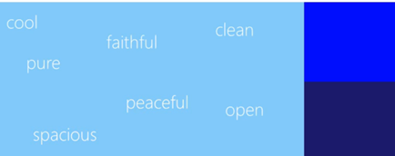
    - 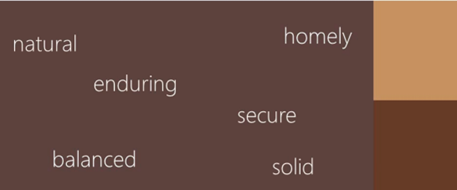
    - 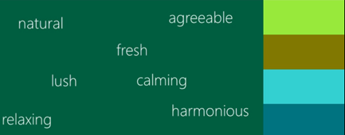
    - 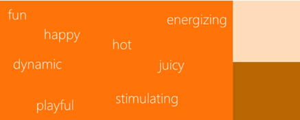
    - 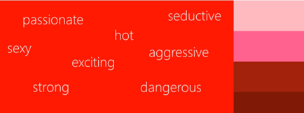
    - 
    - 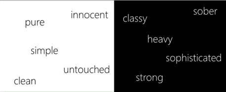
    - 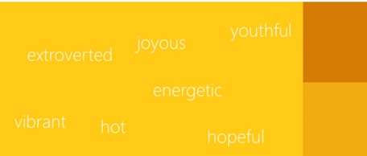

- Color preferences
    - 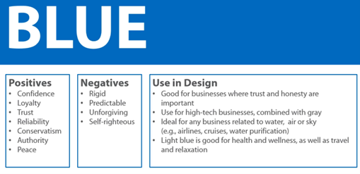
    - 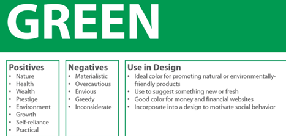
    - 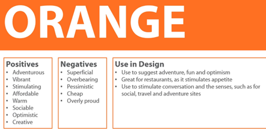
    - 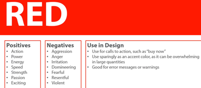
    - 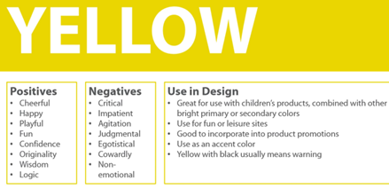

## Unit Testing

- In constructor method we should only build objects and prepares them for use. Don’t construct other dependencies, talk to external resources, execute initialization logic or application logic. Don’t write any logic in constructor. Just use assignments. We should inject dependencies assign to the private variables inside constructor.

- Actually, legacy code is the one which doesn’t have automated test for it. It makes the code more brittle and harder to maintain and extend.

- 

- Types of testing - unit testing, integration testing, acceptence testing (user interface).

- Immutability – an object can’t change its state. Anytime a method would change the state of the object like pushing an item on a stack, it needs to return a new copy of the object with the change. The previous instant remains unchanged. It helps us in writing concurrent code more easily

- Test doubles - it is a generic term for any kind of pretend object used in place of a real object for testing purpose. Types - stubs, fakes, mocks, spies.

- Stubs provide canned answers to calls made during the test. when a fake is being used as a means to guarantee a certain date is returned. A fake is stub when it needs to be setup before the action so that the action can be controlled better, but the results from the action remain the thing being tested, not the fake itself, for what the mock is used for. When a fake is the thing being tested then it is mock as a assertion.

- Mocks are pre-programmed with expectations which forms a specification to be verified.

- Fakes – to isolate our unit test from external resources like API calls. MOQ is a faking library that will help us avoid some of the boilerplate of faking our tests.

- Unit tests are less brittle that’s why they are preferred a lot. It tests smallest behaviour.

- What is pragmatism? A reasonable and logical way of doing thing. that is based on dealing with specific situations instead of ideas and theories.

- Testing structure types - AAA (Act, Arrange, assert), Behavioural (Given, When, Then)

- Anti-patterns – we should test the overall behaviour details instead of implementation details. So, don’t overuse of mock, prefer stub. Focus of return of the function instead of inner details. Tests should be short and to the point.

- Static method should be used only for pure functions like those methods which returns same value for same input, and in future there would be not change needed for those method implementations like math library inbuilt function.

- When adding code to a fixture setup or teardown is that only code that is 100 percent common to all methods should go over there. If a lot not all methods have some common code then use helper method.

- In unit testing don’t use random number to generate random number to test some value, it can generate random failures. So, we should not have random logic.

- We can also have the stub return a certain value if the test subject is expecting a return value. For cases where we are testing interaction behaviour we will create a mock that knows it was called, with what parameters and how many times.

- Naming convention of the test method – choose any naming convention for unit tests that works for you and only try to stick with it consistently throughout the project.
- Instead of using the manual mock we should use automatic mock like MOQ library.
