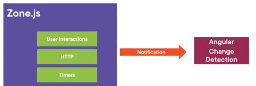

# Extracted

## VS Code

- Fast, cross platform, intellisene and auto complete, debugging, rich refactoring, sits perfectly between editor and IDE.

- What is Editor - lightweight/fast, file/folders, many languages, many workflows, keyboard centered

- What is IDE - project systems, code understanding, debug, integrated build, file->new, wizards, designers, ALM integration, platform tools

- Electron is a native shell for widows, mac, and Linux that hosts JavaScript-based app like Monaco. Visual studio code is a combination of Monaco and Electron.

- Installing extension locally – copy your extension to the VS code extension directory. (windows - %USERPROFILE%\.vscode\extensions)

## User Experience

## Angular

- Angular is a tool to help you build interactive websites, you can call it a framework. It provides tools to communicate with the server and to improve the performance, package application, maintain state, organize code/logic, ease display of data, synchronize state as it changes.

- Angular 2 is more standard based (modern web standards), modern (state management, change detection, etc.), more performant.

- Angular releases major version every 6 months, 6 months of active support and 12 months of LTS support (only security and bug fixes, no new features unlike active support).

- Universal benefits – reduction of cost, standards compliance, extremely performance, open source, use typescript, backed by Google, very uniformity (make onboarding new developers cheaper and simpler), amazing documentation.

- It indirectly provides environment for router, HTTP, forms, RxJS, etc. Already configured with Typescript no need extra to configure, opinionated means fewer decisions to take. Provides support for progressive web apps, lazy-loading, fully reactive forms library support, fully featured router, animations library, supports strictly typed forms.

- Angular also supports server-side rendering, mobile friendly, angular language service (Intellisense and better debugging in templates).

- Components – building blocks of modularity. It breaks up display of application in manageable chunks. It has display and logic.

- Services are a place to put logic which is not related with the display like checking more than article reading limit has been crossed or not.

- Directives are a way to give existing tag a new functionality like making elements or appear on hove, control the visibility, etc.

- Pipes is used, to format the data to display like uppercase.

- Modules are not optional in angular 14. It is a grouping of other features like services, components, pipe and directives, it can also include other modules.

- Application state gets changes on user interaction, http service response or by timer execution.

- Efficient change detection – first the state gets change then cascading changes occurs and finally re-render of page.

- Inefficient change detection – the system is not smart enough to identify the cascading changes and re-render the UI multiple times.

- Zone.js is a wrapper on the things which can change the state change like user interactions, http and timers, it knows when these things gets completed. Angular then subscribed to notification from zone.js so that it can run the change detection and re-render the display.

  

- Rendering targets provided by angular – browser/DOM, server-side, native mobile apps, native desktop apps.

- Angular CLI solves JS fatigue problem which setting up the JS environment to build an application.

- Server side rendering – increase performance as initial download size gets reduced, increase render time, search engine optimization. Modes – full pre-render, dynamic pre-render, client-side switch.

- To build the native mobile apps with angular, there are two common tools ionic and NativeScript. For Native desktop, we need to use Electron.

- Angular testing utilities – TestBed – helpful in testing component with templates. It helps to constructs component in small, live, angular environment and gives us handles to wrapper around component and DOM created by its model. Async and fakeAsync, MockBackend.

- AOT – browser needs to compile the templates into DOM Functions i.e. the actual views. The AOT does it during the compile time itself.
