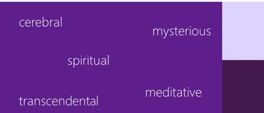

# Extracted Learnings

## Table of Contents

1. [VS Code](#vs-code)
2. [Angular](#angular)
3. [User Experience](#user-experience)
4. [Typescript](#typescript)
5. [Unit Testing](#unit-testing)
6. [Security](#security)

## VS Code

- Fast, cross platform, intellisene and auto complete, debugging, rich refactoring, sits perfectly between editor and IDE.

- What is Editor - lightweight/fast, file/folders, many languages, many workflows, keyboard centered

- What is IDE - project systems, code understanding, debug, integrated build, file->new, wizards, designers, ALM integration, platform tools

- Electron is a native shell for widows, mac, and Linux that hosts JavaScript-based app like Monaco. Visual studio code is a combination of Monaco and Electron.

- Installing extension locally – copy your extension to the VS code extension directory. (windows - %USERPROFILE%\.vscode\extensions)

## Angular

- Angular is a tool to help you build interactive websites, you can call it a framework. It provides tools to communicate with the server and to improve the performance, package application, maintain state, organize code/logic, ease display of data, synchronize state as it changes.

- Angular 2 is more standard based (modern web standards), modern (state management, change detection, etc.), more performant.

- Angular releases major version every 6 months, 6 months of active support and 12 months of LTS support (only security and bug fixes, no new features unlike active support).

- Universal benefits – reduction of cost, standards compliance, extremely performance, open source, use typescript, backed by Google, very uniformity (make onboarding new developers cheaper and simpler), amazing documentation.

- It indirectly provides environment for router, HTTP, forms, RxJS, etc. Already configured with Typescript no need extra to configure, opinionated means fewer decisions to take. Provides support for progressive web apps, lazy-loading, fully reactive forms library support, fully featured router, animations library, supports strictly typed forms.

- Angular also supports server-side rendering, mobile friendly, angular language service (Intellisense and better debugging in templates).

- Components – building blocks of modularity. It breaks up display of application in manageable chunks. It has display and logic.

- Services are a place to put logic which is not related with the display like checking more than article reading limit has been crossed or not.

- Directives are a way to give existing tag a new functionality like making elements or appear on hove, control the visibility, etc.

- Pipes is used, to format the data to display like uppercase.

- Modules are not optional in angular 14. It is a grouping of other features like services, components, pipe and directives, it can also include other modules.

- Application state gets changes on user interaction, http service response or by timer execution.

- Efficient change detection – first the state gets change then cascading changes occurs and finally re-render of page.

- Inefficient change detection – the system is not smart enough to identify the cascading changes and re-render the UI multiple times.

- Zone.js is a wrapper on the things which can change the state change like user interactions, http and timers, it knows when these things gets completed. Angular then subscribed to notification from zone.js so that it can run the change detection and re-render the display.

  

- Rendering targets provided by angular – browser/DOM, server-side, native mobile apps, native desktop apps.

- Angular CLI solves JS fatigue problem which setting up the JS environment to build an application.

- Server side rendering – increase performance as initial download size gets reduced, increase render time, search engine optimization. Modes – full pre-render, dynamic pre-render, client-side switch.

- To build the native mobile apps with angular, there are two common tools ionic and NativeScript. For Native desktop, we need to use Electron.

- Angular testing utilities – TestBed – helpful in testing component with templates. It helps to constructs component in small, live, angular environment and gives us handles to wrapper around component and DOM created by its model. Async and fakeAsync, MockBackend.

- AOT – browser needs to compile the templates into DOM Functions i.e. the actual views. The AOT does it during the compile time itself.

## User Experience

- Software has to work and be easy and enjoyable to work. User can easily and quickly accomplish their tasks.

- Wireframe types - Low-fidelity, High-fidelity.

- Principles - Alignment, Contrast, Visual heirarchy, Proximity, Layouts, Whitespace, Consistency.

- UX Testablity 
    - Visiblity of System Status - the system should always keep users informed about what is going on, through appropriate feedback within reasonable time. Like showing username on login, showing copy/delete progress windows OS.
    - Match between system and the real world - the system should speak the user's language, with words, phrases and concepts familier to user. Like not using words like `Accept/Decline` but `Save password/Nope`.
    - Error prevention - like showing auto-compmlete, showing confirm dialog before deleting the record.
    - Recognition rather than recall - showing dropdown, intellisense

- The good user experience has 3 desired results – happy, satisfied and productive. Our ultimate results should be delighted, contented, and empowered.

- Avoid common pitfalls - throwing data on the screen, exposing tech to the user, forcing the user to think like DBA, Messy UI, coding for expert user.

- 10 UX myths - low friction clicks are okay, vertical scrolling is okay.

- Leading hack - making the user brain work less by leading them to their goal. Showing steps (wizard) on the screen.

- Limit the number of colors used should be 5 or less.

- Reading in upper case takes 10% more time than lower case, so avoid using them.

- A UX developer can bring efficiency, logic, relevance, user advocacy, research, communication, effectiveness, interaction, elegance, simplicity.

- Types of industry - Finance, Education, Retail, Healthcare, Business & IT Services, Research & Developement, Goverment and Defence.

- In natural world there is no monochrome except blue sky overhead on a clear day, even sky is a gradient. So, while creating UI component use gradient from light to dark as top down lighting bias to makes the screen appear as more natural not as artificial monochrome. And the gradient shouldn’t be noticeable and flashy

- Instead of rectangle design, we should use curves. Humans usually prefer curved things over sharp-edged things – curved connotes safety, sharp-edged connotes danger. Curve soften the design and less stressful.

- We should bring the UI element on screen on more gradual way and move that from one place to another in gradual way too or changing the size. Using animation as it feels more natural and don’t surprise or confuse user. While changing the screen from one to another also try to implement a subtle animation. Animation also help in maintaining context.

- When an action is not appropriate, prevent the user from doing it, provide a visual signal that the action is not available, like disabling a button instead of allowing it to click and showing error message or any popup.

- Sliders component are good for numbers with large increments of numbers where the user is not quite so interested in precision.

- Reserve confirmation for very exceptional circumstances, otherwise it will dilute its value like in windows vista. Instead of this we can provide some undo like functionality or show a countdown before making the commit to the database, this is called forgiveness

- Web fonts recommendations
    - 
    - 
    
- Color meanings
    - 
    - 
    - 
    - 
    - 
    - 
    - 
    - 

- Color preferences
    - 
    - 
    - 
    - 
    - 

## Unit Testing

- In constructor method we should only build objects and prepares them for use. Don’t construct other dependencies, talk to external resources, execute initialization logic or application logic. Don’t write any logic in constructor. Just use assignments. We should inject dependencies assign to the private variables inside constructor.

- Actually, legacy code is the one which doesn’t have automated test for it. It makes the code more brittle and harder to maintain and extend.

- 

- Types of testing - unit testing, integration testing, acceptence testing (user interface).

- Immutability – an object can’t change its state. Anytime a method would change the state of the object like pushing an item on a stack, it needs to return a new copy of the object with the change. The previous instant remains unchanged. It helps us in writing concurrent code more easily

- Test doubles - it is a generic term for any kind of pretend object used in place of a real object for testing purpose. Types - stubs, fakes, mocks, spies.

- Stubs provide canned answers to calls made during the test. when a fake is being used as a means to guarantee a certain date is returned. A fake is stub when it needs to be setup before the action so that the action can be controlled better, but the results from the action remain the thing being tested, not the fake itself, for what the mock is used for. When a fake is the thing being tested then it is mock as a assertion.

- Mocks are pre-programmed with expectations which forms a specification to be verified.

- Fakes – to isolate our unit test from external resources like API calls. MOQ is a faking library that will help us avoid some of the boilerplate of faking our tests.

- Unit tests are less brittle that’s why they are preferred a lot. It tests smallest behaviour.

- What is pragmatism? A reasonable and logical way of doing thing. that is based on dealing with specific situations instead of ideas and theories.

- Testing structure types - AAA (Act, Arrange, assert), Behavioural (Given, When, Then)

- Anti-patterns – we should test the overall behaviour details instead of implementation details. So, don’t overuse of mock, prefer stub. Focus of return of the function instead of inner details. Tests should be short and to the point.

- Static method should be used only for pure functions like those methods which returns same value for same input, and in future there would be not change needed for those method implementations like math library inbuilt function.

- When adding code to a fixture setup or teardown is that only code that is 100 percent common to all methods should go over there. If a lot not all methods have some common code then use helper method.

- In unit testing don’t use random number to generate random number to test some value, it can generate random failures. So, we should not have random logic.

- We can also have the stub return a certain value if the test subject is expecting a return value. For cases where we are testing interaction behaviour we will create a mock that knows it was called, with what parameters and how many times.

- Naming convention of the test method – choose any naming convention for unit tests that works for you and only try to stick with it consistently throughout the project.
- Instead of using the manual mock we should use automatic mock like MOQ library.

- We should avoid loops and branching instruction in tests, they may lead to bugs in testing code. It also reduces the cyclomatic complexity.

- Precondition and postconditions of a method pattern, like passing an empty array to an method. In this case the caller function should check the param input before calling to the function, in preconditions a Boolean condition which must be satisfied before a method is invoked, in postcondition a Boolean condition which must be satisfied after a method completes
    - Method precondition - condition which must be satisfied before method is invoked.
    - Method postcondition - condition which must be satisfied by the invoked method after it executes.

- Try to avoid giving classes same names as interfaces they implement, what is specific to this class. Interface names are operating at abstract levels, class names are operating at implementation levels. Interface names are normally vague, inconclusive, while class names are sharp and to the point.
- If a method does not want to accept null parameter then it should not throw an exception as it would be meaningless to the caller function.

- We should handle exceptions like below - 


- Styles of unit testing – output verification or functional verification, state verification, collaboration verification.

- Writing the test is easier then running the application. Testing is not like frosting on the cake, but it is sugar or flour which needs to bake when we are preparing the cake not in the end. This is also same issue with automation testing.

- We should break into code into two type of classes, one which have business logic and others which make stuffs. Don’t combine both classes.

- Benefits of unit testing – higher quality, fewer defects, living documentation, well-crafted code, automatic regression harness. A unit test confirms functionality of a small unit of functionality or component in a larger system.

- Code refactoring should not change the functionality of the application, in the same way the unit test case should not be fail. Refactoring is like cleaning the kitchen after serving food to customer. It improves readability, maintainability and scalability of code. We should refactor the code after fixing a failing test, before adding a new feature or after identifying a quality problem. Simple refactoring – rename, introduce parameter, extract method.

- Isolating code -
    - Dummy – it is the simplest and most primitive type of test double and will contain no implementation.

```typescript
  var person = new Person();
  person.first = "John";
  person.last = "Snow";
  Assert.IsNotNull(person.fullName);
```

    - Stubs – it is a minimal implementation of a class that likely implements a given interface or some abstract base class. It doesn’t maintain state and leaves method unimplemented like it just return some hard-code value directly:
```typescript
public class StubRepo: IOwnerRepository
{
public IOwner FindById(int id){}
public IOWner save(IOwner owner)
{
return new Owner();
}
public void Delete(IOwner owner){}
}
```
    - Fake – building on a stub and adding a bit more sophistication is the idea of fake. It contains a bit more complex implementation by having state but not functional implementation. Like below we actually add and delete the list.
    
    - Spy – it records the information about the interaction that it has with the SUT. This information can be available for assertion purpose by the test itself.
    
    - Mock – can be used to simulate complex behaviour. We should not develop mock our self, we should use mock libraries which allows us to configure mock behaviour. Libraries example – type mock, rhino mock and MOQ.
 
- We can have separate build environment for acceptance test running and can trigger once a day. We can also share it reports to business for progress:


- Prudent code coverage – 100% code coverage doesn’t mean no defects. Use code coverage as a developer tool not a performance metric. Let the code coverage find things that are important enough to add test, but realize that it is only contextually important and it is very rare that we need to strive for any sort of code coverage numbers up around 90 and 100%.

- Devi’s advocate, Gollum style and Ping Pong technique to write unit test case:


- While creating an interface it should either contains all properties or all functions not both.

- It is not creation of millions of objects that keep application from being efficient but it is rather the efficiency of methods that we are executing that may make it slow. So, we can create many objects using immutable objects without causing any performance issue.

- We should only throw exception if there is no way for the application to continue working under circumstances, otherwise implement different use case as-well. Also, don’t handle the exception in immediate caller but at the top most caller, the one which initiated the whole operation, by this the lower parts of the code will be clean from complicated error handling code, they will focus on normal control flow. We can handle this by showing a pop-up to user, retry the function or simply ignoring the error and moving forward. While using the immutable objects try to keep them small.

- While designing a class it should contains operations which naturally belongs to the class, if operation doesn’t belong to a class the move it out to a dependency and use the dependency to complete the operation.

- Test doubles – dummies like a placeholder, stubs objects that return predefined data, fakes slightly more realistic, mocks objects pre-programmed with expected outputs for given inputs and also able to verify their calls, spies real object and verify interactions like mocks it is an hybrid of stubs, fakes and mocks.

- Marble testing is a technique where we draw marble diagrams using ACSII characters while writing unit test to visualize asynchronous observables behavior in a synchronous way. Benefits of marble testing – readable code, test synchronously and helps to find out race condition in our code. Marble syntax - -, |, #, ^, !, a, ()

- For empty observable use |, for never use _ or ----. 

- Hot observables start emitting the values before any subscribe method is called on. Any subscribers can subscribe at any time and they can get the latest values at the time of subscription. They are multicast means more than one subscriber can subscribe to this observable however they will listen to the same producer. Publish and share are used to make a hot observable like tune radio channel, cinema theater, mouse clicks, live movies, live cricket match, stock tickers, live life events.


- Cold Observable – In RxJs the observables are cold by nature. Cold is when the producer is owned by the observable. Observable creates and activates the producer at the time of subscription only. The data is created from the observable itself. Will produce data only when subscribe method has been called. Subscriber get their own copy of values and they are unicast i.e. one subscriber per producer like of, from, interval, timers. Real life example – watching downloaded movies, recorded podcast or song, snapshot movies in which each have their own copy.


- Frame – Jasmine-marbles convers observable sequence into frames. Frame is a JSON that consists of RxJs notification object that wraps the actual delivered value with additional metadata and message type.


- RxJS schedulers are centre to control the time for any operator or observables in our project. Also, RxJS has made this schedulers injectable so that we can mock these schedulers and control the time in our test cases.

- Scheduler is a primitive inside RxJS, RxJS operators take scheduler as the second optional parameter. It is async by default. Marble testing uses virtual time so that we can test these async function synchronously.

- Race condition scenario – in a scenario where we are searching a string, and first search return the value with a delay than second one, then in the result we will get the first result as a final response by overriding the second one. To avoid this we can use the switchMap operator, it will cancel the previous Http request in-case of second has been triggered and always return the latest result.

- In integration test we test component and its template together. In integration if we only test parent component then it becomes shallow integration test otherwise if we also test its working with its child or directive component then it becomes deep integration test.

- To write the integration test to test the template along with component, we need to use the ‘Testbed’.

- A component fixture is a wrapper for component that also has few extra properties for testing, we can use its one of the properties called componentInstance to get the instance of the component itself.

- Use fixture.detectChanges() on component spec files to tell the component to run change detection and update any binding that may exist on the component. It will also cause to ngOnInit() lifecycle to run.

- The flush() method lets us decide what data to send back when the call is made.

## Typescript

## Security

- Content Security Policies (CSP) Reporting - It is regarding the policies send alongside with website says where can this page load images, scripts and styles from, and where the form can post the requests and the browser will restrict the page accordingly. We can send it either in http header or metatags. We can also mention the report-uri where those reports will be sent. It was originally design to stop cross side scripting.

```typescript
Content-Security-Policy: upgrade-insecure-requests
Content-Security-Policy-Report-Only: default-src https:;report-uri https://demo.report-uri.com/r/default/csp/reportOnly
```

- Certificate Authority Authorization (CAA) Reporting - CAA is much safer than HPKP, by which we can say whom we want to authorize some particular CAs to be able to issue certificates for us.

- Cross-site Scripting (XSS) Reporting - Now, the browser has built-in an XSS auditor, in XSS attack we generally have kind of get parameter they sent to the server, rendered into the DOM and then reflected back to the browser.

```typescript
x-xss-protection: 1; report=https://report.uri.com/xss/enforce
```

- Broken Authentication – passwords are very vulnerable and very in-secure. We can refer haveibeenpwned.com and avoid user to choose the password which were breached in history. The password rotation was never a good policy and it works against us as humans are terrible at passwords.

- Sensitive data exposure – SSN, credit cards information, addresses, religion, health records, political affiliation, birthday. Combination of these information can become dangerous.

- XML external entities (XXE) – SAST static source code analysis (manual code reviews), we can also use DAST tool for testing.

- Broken access control – IDOR, indirect object references, where we can twiddle a value in the URL to get someone else’s data. We should test access control so that we can’t do things outside of our privilege level.

- Security Misconfiguration – weak ciphers, SSL problems, we can use tools to check them. 

- Cross-site scripting (XSS) – latest frameworks are helping to prevent this vulnerability.

- Insecure deserialization – remote command execution (RCA) running command on other server, and another thing is changing the serialized objects to elevate our privileges to do something interested, tempering of objects. To avoid this, we can use HMAC and check the validity of object type on server to check its integrity.

- Using components with knows vulnerabilities – we should break our build if any vulnerable component is found. Latest package manager automatically detects such problem with 3rd party libraries and CICD we should break the build. We can use CSP to avoid such issues.

- Insufficient logging and monitoring – we should have some sort of audit trails in place.

- HSTS helps us ensure that connections are always made securely and they never drop back to HTTP.

- What Is Serialization and Deserialization? - When we want to store an object to disk then we need to represent the multi-dimensional object into a flattened format. So, serialization is converting an object into a byte stream. A byte stream can be a file or a data stream over a network.

- Insecure deserialization – (serialized) data abusing the security of an application when being deserialized. Abuse of logic, corrupt data, denial of service, remote code execution. It is possible to execute arbitrary code merely by deserializing a corrupted or untrusted file. It affects confidentiality, integrity and availability.

- We should not use equal sign to compare the two strings as it is not cryptographically secure, as it will lead to timing attach, so always use built-in functions to compare hashes with each other.

- The dangers of logging too much – legislation, confidentiality (credentials, payment details, sensitive information), information overload, cost of processing information. Information exposure through and error message – the dangers of showing users, or non-privileged accounts error messages.

- Certificate authorities – it is an entity that issues digital certificates. Our machine needs to trust a CA. The CA signs the certificate; and when it is returned to the browser from the website, our machine validates that the certificate is legitimate by referring to our local list of trusted authorities. To check this list use certmgr.msc from run command, this list is used by windows, ie and chrome.

- SSL vs. TLS – we should ideally use term TSL not SSL as SSL is dead already:

- HTTP strict transport security (HSTS) – now redirect will give 307 status instead of 301, also the size would be 0. The browser will perform 307 internal redirect. Once our browser sees the STS response header, for the period of time, specified in that max age value, it will not make an insecure request to that domain.

```typescript
strict-transport-security: max-age=2592000
```

```typescript
Status Code: 307 Internal Redirect
Non-Authoritative-Reason: HSTS
```

- Secure cookies – capturing someone cookie will lead to session hijacking. Secure cookie will not get send over insecure connection. So, always use secure cookies flag as default setting:


- 
